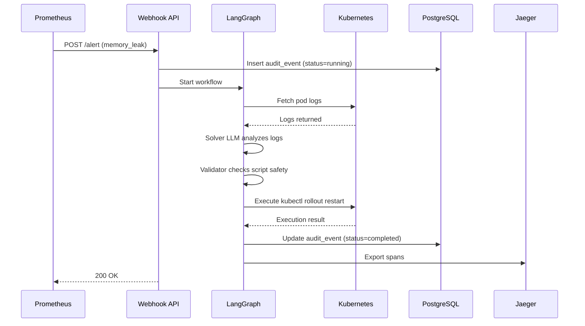

# AutoInfraRemediation - Project Overview

**AI-Powered Kubernetes Auto-Remediation System with Dual-LLM Safety Validation**

---

## 🎯 Project Mission

Automatically detect, analyze, and remediate Kubernetes infrastructure issues using AI-powered workflows with built-in safety validation. The system receives alerts from Prometheus/AlertManager, analyzes them using LangGraph orchestration with Ollama LLMs, generates remediation scripts, validates them through a safety pipeline, and executes approved fixes — all while maintaining comprehensive audit trails and distributed tracing.

---

## 📊 Current Status

**Production Readiness**: 8.5/10  
**Phase Completion**: 3/6 phases complete (Quick Wins ✅, Security Hardening ✅, Infrastructure Complete ✅)  
**Last Updated**: March 31, 2026

### Implementation Progress
- ✅ **Phase 1**: Quick Wins (Regex pre-validation, LLM timeouts/retry, security validation)
- ✅ **Phase 2**: Security Hardening (K8s RBAC, health endpoints, deployment manifests)
- ✅ **Phase 3**: Infrastructure Complete (Prometheus metrics, ServiceMonitor, Terraform backend)
- 🔄 **Phase 4**: Production Hardening (Temporal, Vault, Testing) - 0/3 tasks
- ⏳ **Phase 5**: Operational Maturity (Alert tuning, DB tracing, Sandboxing) - 0/3 tasks
- ⏳ **Phase 6**: Intelligence Enhancements (Caching, Multi-model, Knowledge base) - 0/3 tasks

**See**: [PENDING_TASKS.md](PENDING_TASKS.md) for detailed task breakdown (71-87 hours remaining)

---

## 🏗️ Architecture

### High-Level Flow
```
Prometheus/AlertManager → FastAPI Webhook → LangGraph Pipeline → Kubernetes API
                                ↓
                        PostgreSQL Audit Trail
                                ↓
                        Jaeger Distributed Tracing
```

### Component Breakdown

#### 1. **Webhook API** (`webhook/api.py`)
- **Technology**: FastAPI 0.115.6 with async/await throughout
- **Endpoints**:
  - `GET /` - API information and documentation
  - `GET /health` - Comprehensive health check (Ollama, K8s, PostgreSQL)
  - `GET /health/ready` - Kubernetes readiness probe
  - `GET /health/live` - Kubernetes liveness probe
  - `GET /metrics` - Prometheus metrics exposure
  - `GET /remediations` - View last 50 workflow events from audit trail
  - `POST /alert` - Receive AlertManager webhook notifications
  - `POST /test-alert` - Trigger test alerts (cpu_spike, memory_leak, error_rate)
- **Observability**: 
  - 6 Prometheus metrics (workflows_total, duration_seconds, safety_denials, etc.)
  - OpenTelemetry middleware for request tracing
  - Security validation on startup (checks default credentials)

#### 2. **LangGraph Pipeline** (`webhook/graph.py`)
- **Technology**: LangGraph 0.2.61 with 4-node state machine
- **Pipeline Nodes**:
  1. **Parser** (`parse_and_fetch_logs`): Extracts alert metadata, fetches pod logs from Kubernetes
  2. **Solver** (`solver_node`): LLM analyzes logs and generates RemediationPlan (analysis, script, is_safe)
  3. **Validator** (`safety_validation_node`): Dual-layer validation
     - Programmatic: 13 regex DENY_PATTERNS (rm -rf /, kubectl delete namespace, fork bombs, etc.)
     - AI: Second LLM validates script safety with explicit approval/denial
  4. **Executor** (`execute_remediation_node`): Simulated execution with audit logging

- **Safety Features**:
  - Pre-validation with regex before expensive LLM calls
  - LLM timeout: 30 seconds
  - Retry logic: 3 attempts with exponential backoff (2-10s)
  - Structured Pydantic outputs prevent malformed responses
  - All scripts logged for compliance

#### 3. **Kubernetes Integration** (`webhook/k8s_client.py`)
- **Technology**: Kubernetes Client 31.0.0
- **Capabilities**:
  - Pod discovery by label selectors
  - Log fetching (with tail_lines parameter)
  - Remediation execution (currently simulated for safety)
  - In-cluster config + kubeconfig fallback support
- **RBAC Restrictions** (`infra/webhook-rbac.yaml`):
  - Read-only access to pods (get, list)
  - Read-only access to pod logs (get)
  - NO write permissions
  - NO secrets access
  - NO exec permissions

#### 4. **Audit Trail** (`webhook/database.py`)
- **Technology**: PostgreSQL 16 with AsyncPG
- **Schema** (`audit_events` table):
  - `workflow_id` (unique): Workflow identifier (WF-timestamp)
  - `alert_type`: cpu_spike, memory_leak, error_rate, etc.
  - `status`: running, completed, failed
  - `analysis`: LLM's analysis of the issue
  - `script`: Proposed remediation command
  - `safety_approved`: Boolean (true if passed validation)
  - `safety_reasoning`: Validator's explanation
  - `execution_result`: Command output or error message
  - `duration_seconds`: End-to-end workflow duration
  - `started_at`, `completed_at`: Timestamps
- **Fallback**: In-memory list when `DATABASE_URL` not set

#### 5. **Distributed Tracing** (`webhook/tracing.py`)
- **Technology**: OpenTelemetry with Jaeger backend
- **Configuration**:
  - OTLP HTTP export to Jaeger (port 4318)
  - Service name: `auto-infra-remediation`
  - Traces all 4 graph nodes with spans
  - Captures attributes: LLM model, log character count, safety decisions, durations
  - Toggle via `OTEL_ENABLED` environment variable
- **Jaeger UI**: http://localhost:16686

#### 6. **Infrastructure as Code** (`infra/`)
- **Terraform** (`main.tf`):
  - **GKE Autopilot cluster** with Workload Identity
  - **Helm**: kube-prometheus-stack (Prometheus + AlertManager)
  - **GCS backend**: State storage for team collaboration (commented, ready to use)
- **Kubernetes Manifests**:
  - `webhook-rbac.yaml`: ServiceAccount + Role + RoleBinding (read-only)
  - `webhook-deployment.yaml`: Deployment + Service + ConfigMap with security context
  - `servicemonitor.yaml`: Prometheus ServiceMonitor + 4 PrometheusRules for alerting
  - `alerts.yaml`: AlertManager routing and notification rules

#### 7. **Failure Simulator** (`service/main.go`)
- **Technology**: Go with Gin framework
- **Endpoints**:
  - `GET /cpu-spike`: Simulates high CPU usage
  - `GET /memory-leak`: Simulates memory leak
  - `GET /error-500`: Returns HTTP 500 errors
- **Purpose**: Generate realistic alerts for testing the remediation pipeline

---

## 🛠️ Technology Stack

### Core Dependencies
| Component | Version | Purpose |
|-----------|---------|---------|
| Python | 3.13.2 | Runtime environment |
| FastAPI | 0.115.6 | Web framework for webhook API |
| LangChain | 0.3.14 | LLM orchestration framework |
| LangGraph | 0.2.61 | State machine workflow engine |
| langchain-ollama | - | Ollama LLM integration |
| Ollama | - | Local LLM inference (qwen2.5:3b default) |
| Kubernetes Client | 31.0.0 | K8s API interactions |
| AsyncPG | - | PostgreSQL async driver |
| prometheus-client | 0.19.0 | Metrics exposition |
| OpenTelemetry | - | Distributed tracing (OTLP HTTP) |
| Jaeger | 1.55 | Trace collection and visualization |
| Terraform | ~5.0 | Infrastructure as Code |
| GKE Autopilot | - | Managed Kubernetes cluster |

### Infrastructure Services
- **Ollama**: Local LLM inference server (http://localhost:11434)
- **PostgreSQL**: Audit trail database (port 5432)
- **Jaeger**: Tracing backend (UI: 16686, OTLP: 4318)
- **Prometheus**: Metrics collection and alerting
- **AlertManager**: Alert routing and notification

---

## 🚀 Quick Start

### Prerequisites
```powershell
# 1. Install Ollama
winget install Ollama.Ollama

# 2. Pull required LLM model
ollama pull qwen2.5:3b

# 3. Start Ollama server
ollama serve

# 4. Start infrastructure (PostgreSQL + Jaeger)
cd AutoInfraRemediation/webhook
docker-compose up -d
```

### Running the System
```powershell
# 1. Activate Python virtual environment
.\.venv\Scripts\Activate.ps1

# 2. Install dependencies
cd AutoInfraRemediation\webhook
pip install -r requirements.txt

# 3. Configure environment
cp .env.example .env
# Edit .env with your settings

# 4. Start the webhook API
python api.py
```

### Accessing Services
- **API**: http://localhost:8001
- **Health Check**: http://localhost:8001/health
- **Metrics**: http://localhost:8001/metrics
- **Remediation History**: http://localhost:8001/remediations
- **Jaeger UI**: http://localhost:16686

### Testing the System
```powershell
# Trigger a test alert
Invoke-RestMethod -Uri "http://localhost:8001/test-alert" `
  -Method Post `
  -Body (@{alert_type="memory_leak"} | ConvertTo-Json) `
  -ContentType "application/json"

# Wait 30-40 seconds, then check results
Invoke-RestMethod -Uri "http://localhost:8001/remediations" -Method Get | Select-Object -First 1
```

---

## 🔒 Security Features

### Implemented (Phase 1-3)
- ✅ **Regex Pre-validation**: 13 deny patterns block dangerous commands before LLM calls
- ✅ **Dual-LLM Validation**: Second LLM reviews scripts for safety
- ✅ **LLM Timeouts**: 30-second timeout prevents hanging requests
- ✅ **Retry Logic**: 3 attempts with exponential backoff
- ✅ **Credential Validation**: Startup checks for default/weak passwords
- ✅ **K8s RBAC**: Read-only ServiceAccount with minimal permissions
- ✅ **Security Context**: runAsNonRoot, drop ALL capabilities, readOnlyRootFilesystem
- ✅ **Audit Trail**: All workflows logged to PostgreSQL for compliance
- ✅ **Structured Outputs**: Pydantic validation prevents injection attacks

### Pending (Phase 4-6)
- ⏳ **Vault Integration**: Secrets management with rotation support
- ⏳ **Script Sandboxing**: Execute kubectl in ephemeral K8s Jobs with network policies
- ⏳ **Testing Suite**: 70%+ code coverage with security-focused tests

---

## 📈 Observability

### Prometheus Metrics
| Metric | Type | Description |
|--------|------|-------------|
| `remediation_workflows_total` | Counter | Total workflows started by alert type |
| `remediation_duration_seconds` | Histogram | Workflow execution duration |
| `remediation_safety_validation_denials` | Counter | Scripts denied by safety validator |
| `remediation_execution_failures` | Counter | Failed executions by alert type |
| `remediation_active_workflows` | Gauge | Currently running workflows |
| `remediation_llm_invocation_failures` | Counter | LLM timeout/error count |

### Alerting Rules (Phase 3)
- **HighSafetyValidationDenialRate**: >0.5 denials/sec for 5 minutes
- **HighRemediationFailureRate**: >0.3 failures/sec for 5 minutes
- **SlowRemediationWorkflows**: p95 latency >60s for 10 minutes
- **NoRemediationWorkflows**: No workflows for 30 minutes

### Health Checks
- **Readiness Probe** (`/health/ready`): Checks Ollama connectivity (returns 503 if unavailable)
- **Liveness Probe** (`/health/live`): Confirms API process is alive
- **Dependency Check** (`/health`): Reports status of Ollama, Kubernetes, PostgreSQL

---

## 🔄 Workflow Example

### Scenario: Memory Leak Detected


### Example Workflow Result
```json
{
  "workflow_id": "WF-1774965670",
  "alert_type": "memory_leak",
  "status": "completed",
  "analysis": "Memory usage exceeds 80% due to possible memory leak in the auto-remediation-service pod in namespace default.",
  "script": "kubectl rollout restart deployment auto-remediation-service",
  "safety_approved": true,
  "safety_reasoning": "Safe command - rollout restart is non-destructive and recommended for memory leaks.",
  "execution_result": "Remediation executed successfully (simulated for safety).",
  "duration_seconds": 33.46,
  "started_at": "2026-03-31T19:31:10.307626+05:30",
  "completed_at": "2026-03-31T14:01:43.920772+05:30"
}
```

---

## 📁 Project Structure

```
AutoInfraRemediation/
├── webhook/                      # Main application
│   ├── api.py                    # FastAPI webhook server (8 endpoints)
│   ├── graph.py                  # LangGraph pipeline (4 nodes)
│   ├── database.py               # PostgreSQL audit trail
│   ├── k8s_client.py             # Kubernetes API client
│   ├── tracing.py                # OpenTelemetry configuration
│   ├── docker-compose.yml        # PostgreSQL + Jaeger
│   ├── requirements.txt          # Python dependencies
│   ├── .env.example              # Environment template
│   └── __pycache__/
├── infra/                        # Infrastructure as Code
│   ├── main.tf                   # GKE Autopilot + Prometheus
│   ├── webhook-rbac.yaml         # K8s ServiceAccount (read-only)
│   ├── webhook-deployment.yaml   # K8s Deployment + Service
│   ├── servicemonitor.yaml       # Prometheus ServiceMonitor + Rules
│   ├── alerts.yaml               # AlertManager configuration
│   └── app.yaml                  # Legacy configuration
├── service/                      # Failure simulator (Go)
│   ├── main.go                   # HTTP server with failure endpoints
│   ├── go.mod                    # Go dependencies
│   └── Dockerfile                # Container image
├── ROADMAP.md                    # Feature roadmap and history
├── PENDING_TASKS.md              # Phase 4-6 task breakdown (71-87h)
├── PROJECT_OVERVIEW.md           # This file
├── requirements.txt              # Top-level dependencies
└── .gitignore                    # Git exclusions
```

---

## 🐛 Known Issues

### 1. LLM Pydantic Field Name Mismatch (Active)
**Severity**: Medium  
**Impact**: 3/5 recent workflows failed validation  
**Status**: Fix in progress (adding `format="json"` + explicit schema in prompts)

**Error**:
```
1 validation error for RemediationPlan
analysis
  Field required [type=missing, input_value={'analysis_script': '...', 'is_safe': False, 'script': ''}, input_type=dict]
```

**Root Cause**: LLM (qwen2.5:3b) returning `analysis_script` instead of `analysis` despite Pydantic schema.

**Mitigation**: Server restart required after recent fixes. Alternative: Switch to more capable model (qwen2.5:14b, llama3.1:8b) or implement manual parsing fallback.

**Tracking**: Will be fully resolved in Phase 4.3 (Comprehensive Testing Suite)

---

## 🎯 Next Steps

### Immediate (Phase 4 - Production Hardening)
1. **Temporal Workflow Integration** (8-12h): Wrap pipeline in Temporal for exactly-once execution and crash recovery
2. **HashiCorp Vault Integration** (6-8h): Replace .env secrets with Vault KV store
3. **Comprehensive Testing Suite** (8-10h): Unit, integration, and E2E tests with 70%+ coverage

### Short-term (Phase 5 - Operational Maturity)
4. **Alert Tuning Module** (5-6h): Dynamic thresholds, escalation logic, Slack/PagerDuty integration
5. **Database Tracing Enhancement** (3-4h): OpenTelemetry spans for PostgreSQL queries
6. **Script Sandboxing Layer** (10-12h): Execute kubectl in ephemeral Jobs with network policies

### Long-term (Phase 6 - Intelligence Enhancements)
7. **LLM Response Caching** (5-6h): Redis cache for identical alerts (1h TTL)
8. **Multi-Model Fallback Chain** (12-15h): qwen2.5:3b → llama3.1:8b → OpenAI GPT-4
9. **Knowledge Base Integration** (8-10h): ChromaDB vector store with RAG for historical remediations

**Total Remaining**: 71-87 hours (see [PENDING_TASKS.md](PENDING_TASKS.md))

---

## 📚 Documentation

- **[ROADMAP.md](ROADMAP.md)**: Completed features and pending upgrades
- **[PENDING_TASKS.md](PENDING_TASKS.md)**: Detailed Phase 4-6 task breakdown with acceptance criteria
- **[.env.example](webhook/.env.example)**: Environment configuration template with security notes
- **API Documentation**: Built-in at http://localhost:8001 (FastAPI auto-generated)

---

## 🤝 Contributing

### Development Workflow
1. Create feature branch: `git checkout -b feature/your-feature`
2. Implement changes with tests
3. Run health checks: `curl http://localhost:8001/health`
4. Trigger test workflow: `POST /test-alert`
5. Verify metrics: `curl http://localhost:8001/metrics`
6. Check traces in Jaeger: http://localhost:16686
7. Commit with descriptive message: `git commit -m "feat: add feature X"`
8. Push and create PR

### Code Standards
- **Python**: Follow PEP 8, use type hints, async/await for I/O
- **Security**: All scripts must pass dual-validation (regex + LLM)
- **Testing**: Aim for 70%+ coverage (enforced in Phase 4.3)
- **Logging**: Use structured logging with log levels (INFO, WARNING, ERROR)
- **Tracing**: Add OpenTelemetry spans for new operations

---

## 📞 Support & Contact

**Project**: AutoInfraRemediation  
**Version**: 1.0.0  
**Status**: Active Development  
**Production Readiness**: 8.5/10

**Health Check**: http://localhost:8001/health  
**Metrics**: http://localhost:8001/metrics  
**Tracing**: http://localhost:16686

---

## 📜 License

Proprietary - Zephvion © 2026

---

**Last Updated**: March 31, 2026  
**Next Review**: After Phase 4 completion
